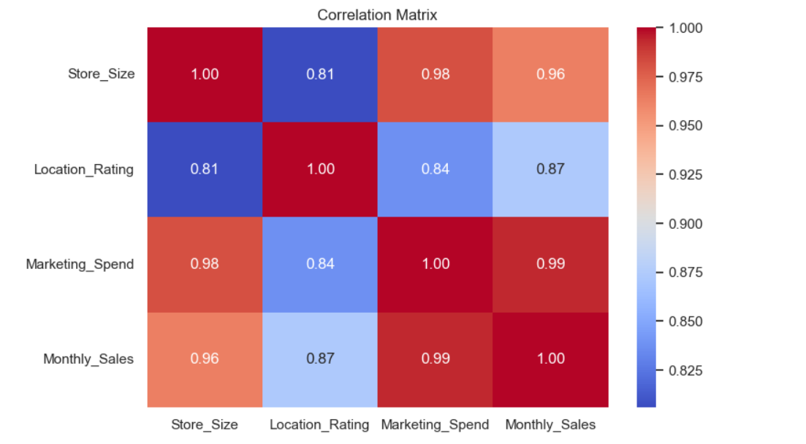

# ​​ Retail Sales Predictor – Business-Driven Sales Forecasting App

A **Streamlit-powered web application** designed for **retail managers, business analysts, and category heads** to forecast store-level sales using key business drivers such as store size, marketing spend, and location rating.

This tool enables faster, more informed decision-making in:
- Inventory planning  
- Campaign performance estimation  
- Regional sales performance benchmarking  

---

## ​ Business Context

Retail organizations often face challenges like:
- Misaligned sales projections causing overstocking or stockouts  
- Unmeasured ROI on marketing investments  
- Limited visibility into store-level performance due to regional variances  

**Solution**: A predictive model wrapped in an intuitive web interface to forecast monthly sales using core business-driven variables.

---

## ​ Project Objective

Develop an **interpretable**, **deployable** machine learning solution that:
- Forecasts store-level retail sales  
- Empowers regional managers with input-based forecasting  
- Is accessible through a user-friendly Streamlit web app  

---

## ​ Live Demo

👉 [Try the Live App](https://retail-sales-predictor-akfxck5hpg4wdpn3shexnn.streamlit.app/#retail-sales-prediction-app)

---

## ​ Model Overview

- **Algorithm**: Linear Regression (fast and interpretable)  
- **Target Variable**: `Store_Sales`  
- **Input Features**:
  - `Store_Size` (sq. ft.)  
  - `Location_Rating` (footfall potential / catchment quality)  
  - `Marketing_Spend` (monthly advertising budget)  
  - `Monthly_Sales` (previous month’s sales)  

> A Decision Tree Regressor was also evaluated as a benchmark.

---

## ​ Exploratory Data Analysis (EDA) Charts

_(Insert visualizations here to highlight actionable insights)_

- **Sales Distribution**  
  

- **Store Size vs Sales**  
  

- **Marketing Spend vs Sales**  
  

- **Correlation Heatmap of Features**  
  

---

## ​ Model Performance

| Metric        | Linear Regression | Decision Tree |
|---------------|-------------------|----------------|
| MAE           | 8,762.76          | 11,732.30      |
| RMSE          | 10,646.98         | 15,046.47      |
| R² Score      | 0.15              | -0.70          |

**Insight**: Linear Regression was chosen for its predictive stability and interpretability.

---

## ​ Insights Summary

- **Marketing Spend**: Shows a strong positive correlation with sales, though diminishing returns appear beyond a threshold.  
- **Store Size**: Generally scales with higher sales, up to an optimal point.  
- **Location Rating**: Reflects regional variances in foot traffic and purchasing behavior.  

---

## ​ Visuals

###  Predicted vs Actual Sales  


Demonstrates how aligned model outputs are with actual sales.

###  App Interface  


Clean and intuitive UI for instant forecasting based on key store parameters.

---

## ​ Business Impact (Hypothetical Scenario)

Scale to a 500-store network:
- Reduce monthly forecast error (MAE) by ~$8.7K/store → **Potential annual savings: $5M+**
- Improve ROI on marketing campaigns by forecasting their impact  
- Identify underperforming stores for corrective action

---

## ​​ How to Run Locally

```bash
git clone https://github.com/AnkitSingh06/retail-sales-predictor.git
cd retail-sales-predictor
pip install -r requirements.txt
streamlit run app.py
