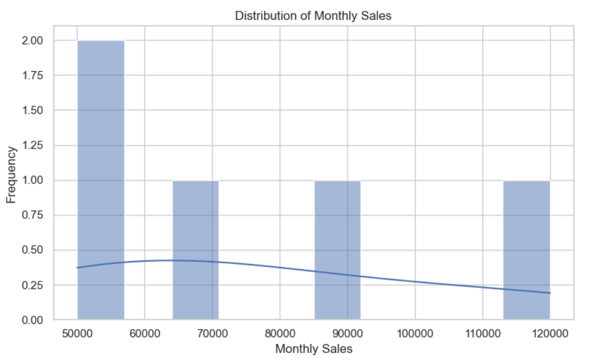
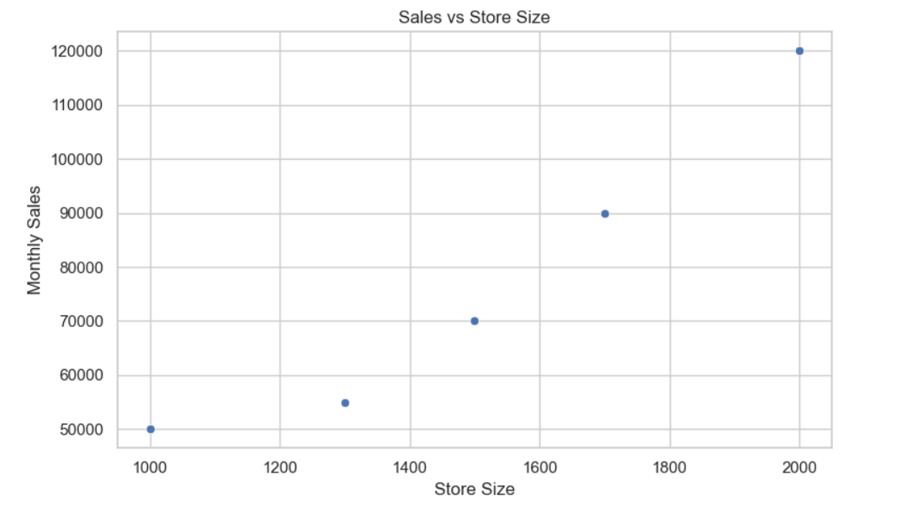
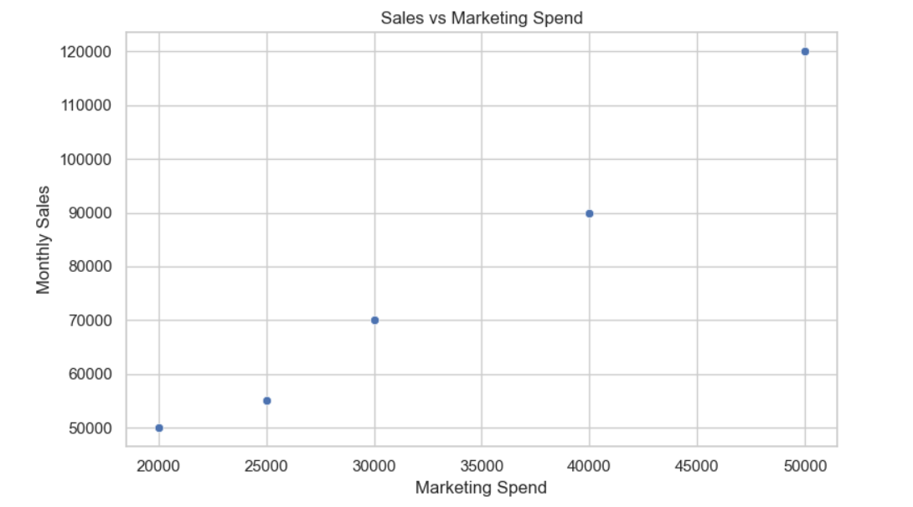

# 🛍️ Retail Sales Predictor

A **data-driven retail analytics solution** that leverages **Machine Learning** to predict store sales based on operational and marketing features.  
This project simulates the kind of retail optimization work done combining **exploratory data analysis (EDA)**, **predictive modeling**, and a **Streamlit dashboard** for business decision-making.

---

## 📊 Problem Statement

Retailers often face challenges in:
- Accurately forecasting store sales
- Identifying store attributes influencing performance
- Optimizing marketing spend and inventory allocation

This project addresses these challenges by:
1. Performing **EDA** to identify patterns, correlations, and anomalies.
2. Building **ML models** to predict `Store_Sales`.
3. Deploying an **interactive app** for business users to simulate store performance.

---

## 📂 Dataset

The dataset includes:
- `Store_Size` (sq ft)
- `Location_Rating` (1-10)
- `Marketing_Spend` (USD)
- `Monthly_Sales` (USD)

---

## 🧠 Machine Learning Models

| Model              | MAE     | RMSE     | R² Score |
|--------------------|---------|----------|----------|
| Linear Regression  | 8762.76 | 10646.98 | 0.15     |
| Decision Tree      | 11732.3 | 15046.47 | -0.70    |

> **Key Insight:** Linear Regression outperforms Decision Tree for this dataset, indicating a more linear relationship between predictors and sales.

---

## 📈 Exploratory Data Analysis (EDA)

### 1️⃣ Sales Distribution
  
- Shows the spread of monthly sales values.

### 2️⃣ Store Size vs Sales
  
- Larger stores generally have higher sales.

### 3️⃣ Marketing Spend Impact
  
- Positive correlation between marketing investment and store performance.

### 4️⃣ Location Rating Correlation
  
- Premium locations outperform low-rated areas.

---

## 🚀 App Demo

**Live App** → [Retail Sales Predictor on Streamlit](https://retail-sales-predictor-akfxck5hpg4wdpn3shexnn.streamlit.app/#retail-sales-prediction-app)  

**Features:**
- Interactive sliders & inputs
- Instant sales predictions
- Scenario analysis for decision-making

---

## ⚙️ How to Run Locally

```bash
git clone https://github.com/AnkitSingh06/retail-sales-predictor.git
cd retail-sales-predictor
pip install -r requirements.txt
streamlit run app.py
