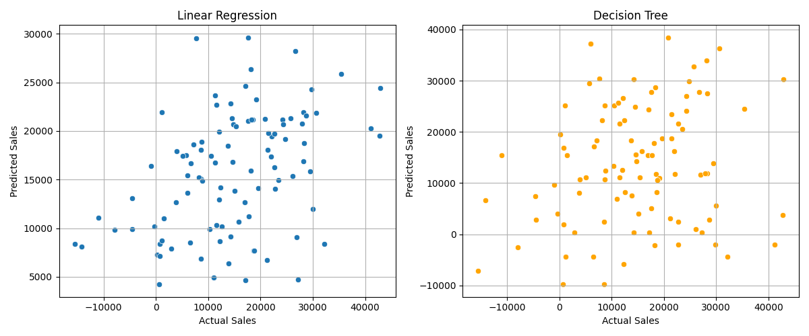
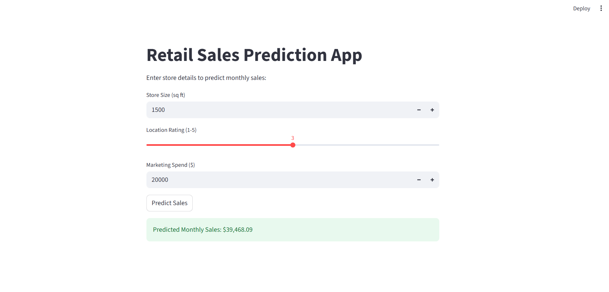

# 🛍️ Retail Sales Predictor

A Streamlit-powered web app that predicts retail sales using a trained machine learning model based on store attributes. It allows business users and analysts to quickly estimate sales with intuitive inputs.

---

## 📺 Demo

👉 [Live App on Streamlit](https://retail-sales-predictor-akfxck5hpg4wdpn3shexnn.streamlit.app/#retail-sales-prediction-app)  

---

## 🧠 Model Overview

- **Type**: Linear Regression
- **Target Variable**: `Store_Sales`
- **Input Features**:
  - `Store_Size`
  - `Location_Rating`
  - `Marketing_Spend`
  - `Monthly_Sales`
---

## 📈 Evaluation Metrics

| Metric        | Linear Regression | Decision Tree |
|---------------|-------------------|----------------|
| MAE           | 8762.76           | 11732.30       |
| RMSE          | 10646.98          | 15046.47       |
| R² Score      | 0.15              | -0.70          |

### 📈 Predicted vs Actual Plot



*This plot shows how well the model predictions align with actual sales values.*

---

## 🖼️ App Preview

Below is a preview of the deployed Streamlit web app:



---

## ⚙️ How to Run Locally

```bash
git clone https://github.com/AnkitSingh06/retail-sales-predictor.git
cd retail-sales-predictor
pip install -r requirements.txt
streamlit run app.py

